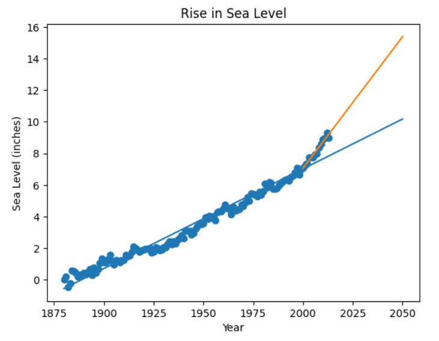

# Sea Level Predictor

## Overview

Sea Level Predictor is a data analysis project that examines historical sea level measurements and predicts future sea level trends using linear regression. The project uses Python and scientific computing libraries to visualize historical data, identify trends, and estimate future sea levels based on statistical models.

## Features

* Analyze historical sea level data
* Visualize sea level trends using scatter plots
* Apply linear regression to historical records
* Predict future sea levels up to the year 2050
* Compare long-term and recent trend predictions
* Generate publication-quality visualizations

## Dataset

The project uses historical sea level measurements containing:

* Year of observation
* Average sea level measurements

The dataset is stored in:

```text
sealevel.xls
```

## Technologies Used

* Python
* Pandas
* Matplotlib
* SciPy
* Jupyter Notebook

## Project Structure

```text
Sea_Level_Predictor/
├── README.md
├── SeaLevelPredictor.ipynb
├── sealevel.xls
└──sea_level_prediction.png
```

## Installation

1. Clone the repository:

```bash
git clone https://github.com/Swaroop-Haridas/Sea_Level_Predictor.git
```

2. Navigate to the project directory:

```bash
cd Sea_Level_Predictor
```

3. Install the required dependencies:

```bash
pip install pandas matplotlib scipy openpyxl xlrd
```

## Usage

1. Open the Jupyter Notebook:

```bash
jupyter notebook
```

2. Launch:

```text
SeaLevelPredictor.ipynb
```

3. Run all cells to:

   * Load the dataset
   * Visualize historical sea level data
   * Perform linear regression analysis
   * Generate future predictions

## Results

The project produces:

* Scatter plot of historical sea levels
* Best-fit regression line using all available data
* Recent-trend regression line
* Future sea level predictions through 2050

## Sample Output

Add the generated plot here:


